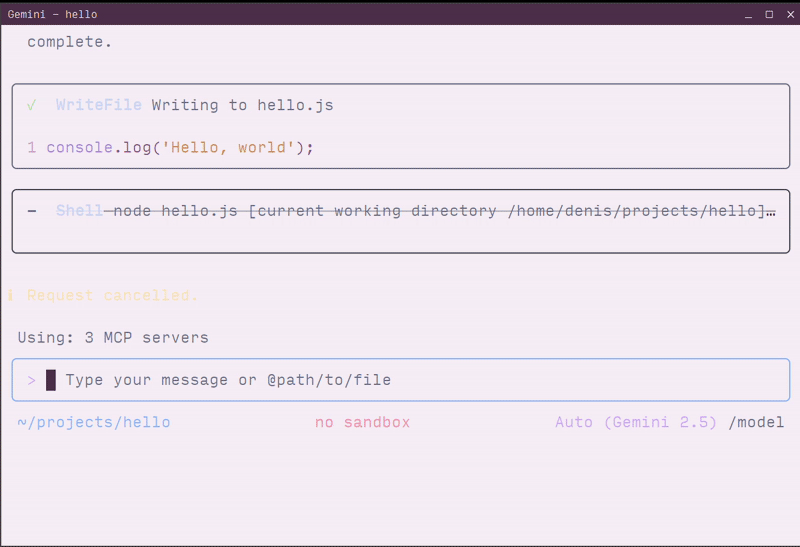

# notify-mcp

A lightweight Bash-based Model Context Protocol (MCP) server for sending desktop notifications via `notify-send`. This zero-dependency server enables AI assistants like Claude, Cursor, and VS Code to send system notifications directly to your Linux desktop.



## Prerequisites

- Linux system with notification support
- `notify-send` command (usually provided by `libnotify` package)
- `jq` tool

### Installing notify-send

If `notify-send` is not installed on your system:

**Ubuntu/Debian:**

```bash
sudo apt-get install libnotify-bin
```

**Fedora/RHEL:**

```bash
sudo dnf install libnotify
```

**Arch Linux:**

```bash
sudo pacman -S libnotify
```

**Alt Linux:**

```bash
sudo apt-get install notify-send
```

## Installation

1. Clone the repository:

```bash
git clone https://github.com/longdog/notify-mcp.git
cd notify-mcp
```

2. Make the script executable:

```bash
chmod +x notify-mcp.sh
```

3. (Optional) Add to your PATH for easier access:

```bash
sudo ln -s $(pwd)/notify-mcp.sh /usr/local/bin/notify-mcp
```

## Configuration

### Claude Desktop

Claude Desktop uses a JSON configuration file to define MCP servers.

1. Open Claude Desktop settings:

   - Click **Claude** menu → **Settings** → **Developer** tab
   - Click **Edit Config** to open `claude_desktop_config.json`

2. Add the notify-mcp server configuration:

```json
{
  "mcpServers": {
    "notify": {
      "command": "/absolute/path/to/notify-mcp.sh",
      "args": []
    }
  }
}
```

**Example with full path:**

```json
{
  "mcpServers": {
    "notify": {
      "command": "/home/username/notify-mcp/notify-mcp.sh",
      "args": []
    }
  }
}
```

3. Save the file and restart Claude Desktop

4. Verify the connection by looking for the MCP server indicator (🔌 icon) in the Claude Desktop interface

### Cursor

Cursor IDE supports MCP servers through its settings configuration.

1. Open Cursor settings:

   - Press `Ctrl+Shift+P` (Linux/Windows) or `Cmd+Shift+P` (macOS)
   - Search for **"MCP: Add MCP Server"**
   - Select **Command (stdio)**

2. Configure the server:
   - **Name:** `notify`
   - **Command:** `/absolute/path/to/notify-mcp.sh`
   - **Arguments:** (leave empty)

**Alternative: Manual configuration**

Edit your Cursor settings file (`.cursor/mcp.json` in your workspace):

```json
{
  "mcpServers": {
    "notify": {
      "command": "/home/username/notify-mcp/notify-mcp.sh",
      "args": []
    }
  }
}
```

3. Restart Cursor to apply changes

### VS Code

VS Code supports MCP servers through the GitHub Copilot extension.

1. **Via Command Palette:**

   - Press `Ctrl+Shift+P` (Linux/Windows) or `Cmd+Shift+P` (macOS)
   - Run **"MCP: Add Server"**
   - Select **Command (stdio)**
   - Enter the server information:
     - **Name:** `notify`
     - **Command:** `/absolute/path/to/notify-mcp.sh`

2. **Via Configuration File:**

   Add to your user settings (`.vscode/mcp.json`) or workspace settings:

```json
{
  "servers": {
    "notify": {
      "command": "/home/username/notify-mcp/notify-mcp.sh",
      "args": []
    }
  }
}
```

3. Restart VS Code to load the MCP server

4. Verify by running **"MCP: List Servers"** from the Command Palette

### Gemini CLI

The Gemini CLI supports MCP servers through its settings configuration file.

1. Locate your Gemini CLI settings file:

```bash
~/.gemini/settings.json
```

2. Add the notify-mcp server to the `mcpServers` section:

```json
{
  "mcpServers": {
    "notify": {
      "command": "/home/username/notify-mcp/notify-mcp.sh",
      "args": []
    }
  }
}
```

**Complete example:**

```json
{
  "apiKey": "your-api-key",
  "mcpServers": {
    "notify": {
      "command": "/home/username/notify-mcp/notify-mcp.sh",
      "args": []
    }
  },
  "mcp": {
    "allowed": ["notify"]
  }
}
```

3. Restart Gemini CLI or start a new session:

```bash
gemini-cli
```

4. Verify the server is loaded:

```bash
/mcp
```

This will list all connected MCP servers, including `notify`.

### Alternative: Using STDIO Transport Directly

For testing or advanced use cases, you can interact with the MCP server directly via stdio:

```bash
echo '{"jsonrpc":"2.0","id":"2","method":"tools/call","params": {"arguments":{"title":"Hello","message":"World"}}}' | ./notify-mcp.sh
```
